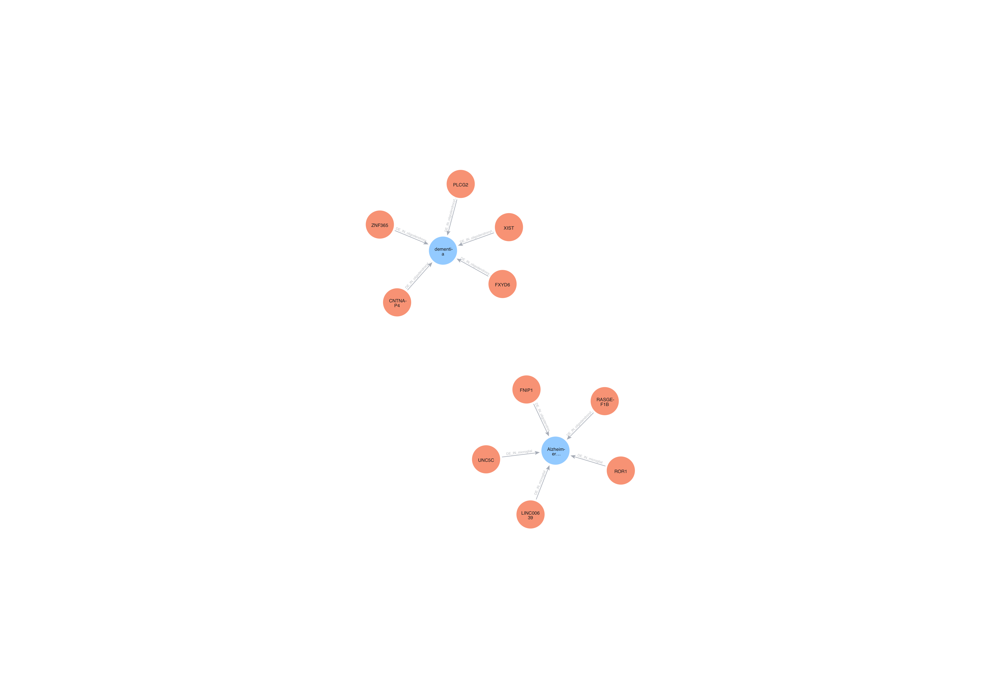

# GenBio AI Cell Data Engineer Homework 2
## Tyler Katz

### Task: Creating a harmonized dataset of disease-associated genes and pathways in the human brain

The script `get_brain_data.py` uses the `Downloader` class in `core/downloader.py` to download single cell data from the CZI CellxGene Census. It takes a tissue type to find data for as well as a list of diseases and cell types to subsample the data. In `de_analyzer.py`, there are methods to analyze the single cell data and run differential expression analysis for each cell type and disease pair (analyzed as cell_type+disease vs cell_type+normal). The `disease_mapper.py` script maps the disease names from CellxGene Census to different disease ontologies including MESH, DO, MONDO, and EFO. The `gene_mapper.py` script maps gene symbols from the CellxGene Census data to Ensembl gene IDs and Entrez gene IDs. In `core/open_targets.py`, the function `get_targets_for_efo_ids` uses the OpenTargets API to get additional gene-level disease-association evidence for a list of disease EFO IDs. The script `neo4j_graph.py`, stores the extended differential expression data in a Neo4j graph database with gene and disease nodes and cell type edges. Each gene node has attributes symbol, entrez, and ensembl for the relevant IDs and each disease node has attributes name, mondo ID, DOID, and MESH ID. The edges connect a gene to a disease and have attributes of the cell type and the log fold change. 

The top 5 most significant genes for each disease were then visualized and shown here. This graph corresponds to a subsampled set of brain SC data including only Alzheimer's and dementia data for microglial cells and oligodendrocytes. For each cell type, the same number of normal cells were subsampled from the brain data to run the DE analysis. 

